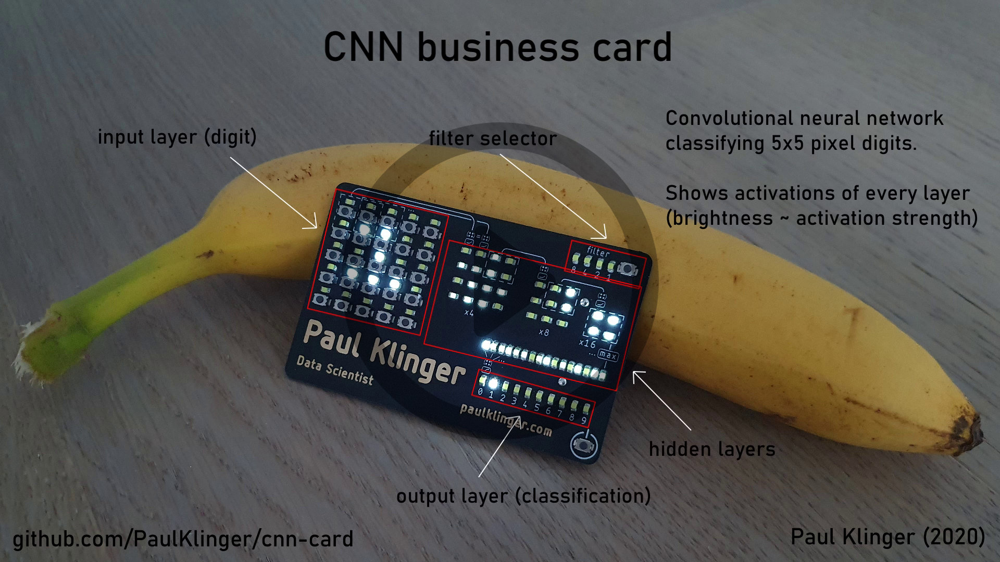

# CNN card

Business card that runs a convolutional neural network to classify 5x5 pixel digits and shows the internal activations for all layers.

## Model
Training data / notebook for the cnn [here](https://github.com/PaulKlinger/cnn_card/blob/master/cnn).

The model consists of 3 convolutional layers (4, 8, 16 filters) and a dense layer at the output. The training data is manually generated (whatever I could come up with) + some augmentation (shifting & random pixel flips). The number of parameters is quite large compared to the number of training samples so this is probably mostly overfitting (although that might be the wrong word here, as I don't think there are many more possible samples I could have included).

## Code
The embedded code is in the [cnn_card_embedded_code.X](https://github.com/PaulKlinger/cnn_card/tree/master/cnn_card_embedded_code.X) folder (MplabX project).

The leds and buttons are driven/scanned using multiplexing, via two shift registers. The main challenge with the code was making this fast and consistent enough to allow PWM control of the brightness.

The model weights are exported to c code in [train.ipynb](https://github.com/PaulKlinger/cnn_card/blob/master/cnn/train.ipynb) and copied to [model_weights.c](https://github.com/PaulKlinger/cnn_card/blob/master/cnn_card_embedded_code.X/model_weights.c).

The aux_code directory contains some auxiliary notebooks: One to generate the startup animation (concentric pulse) and one to calculate the gamma correction table for the leds.

## Electronics
PCB design (gerbers and Eagle/Fusion sources) in the [pcb folder](https://github.com/PaulKlinger/cnn_card/tree/master/pcb).

List of components (bill of materials) [here](https://github.com/PaulKlinger/cnn_card/blob/master/bom.csv).

I had the PCB made by elecrow.com, 1mm thickness, ENIG, matte black soldermask. I also ordered a stencil from them and used hot air & paste to solder everything (except for the battery/holder, that was done manually).

For testing I used the coin cell battery holder listed in the BOM, and then replaced it with a CR2032 with tabs soldered on (to reduce the thickness a bit).

The battery should last basically forever (decades) in standby (0.14 µA) and > 10 hours during use (it draws less than 10mA at maximum (max brightness on all leds) but probably closer to 2-3mA in normal use). After 2min of no input it automatically goes into standby mode.

I found that using white LEDs works best (in terms of max brightness), even though the forward voltage looks like it should be too high for the CR2032. At the low currents here (<0.1 mA averaged per led, <1mA momentarily due to the multiplexing) the forward voltage isn't a problem and white LEDs are just much more efficient. Also, the phosphor means that the light is more diffuse which looks nicer.
